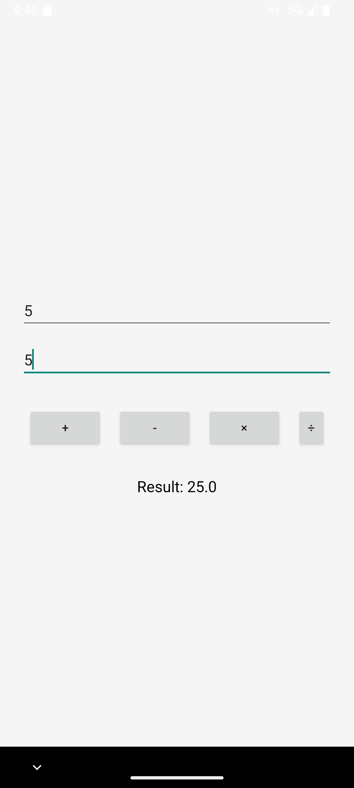
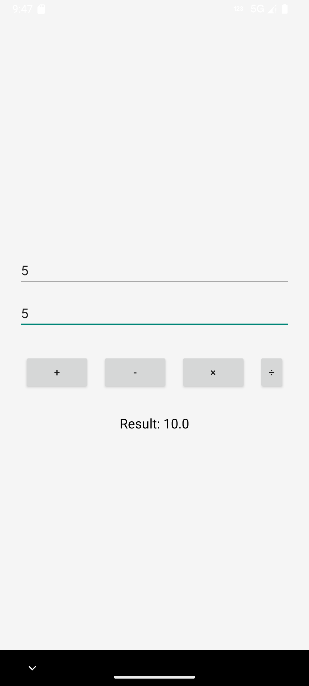

# 📱 Simple Calculator App

A simple, fully functional Android calculator app built using **Java** and **Android Studio**.  
Performs all basic operations: **Addition, Subtraction, Multiplication, Division**.

---

## 🚀 Features

- Basic calculator functionality ( + − × ÷ )
- Intuitive UI with button interactions
- Light theme interface
- Fully offline and fast

---

## 🖼️ Screenshots

| Home Screen | Example Multiplication | Example Addition |
|-------------|------------------|------------------|
|  |  |  |

---

## 🛠️ Tech Stack

- **Language:** Java
- **IDE:** Android Studio
- **Minimum SDK:** 21 (Android 5.0 Lollipop)
- **Target SDK:** 34 (Android 14)

---

## 📦 How to Install

1. Clone the repo:
   ```bash
   git clone https://github.com/Roni-Seikh/SimpleCalculator.git
Open in Android Studio

Let Gradle sync finish

Run on emulator or real device

📁 Folder Structure
swift
Copy
Edit
SimpleCalculator/
│
├── app/
│   ├── src/
│   │   ├── main/
│   │   │   ├── java/com/example/simplecalculator/MainActivity.java
│   │   │   ├── res/layout/activity_main.xml
│   │   │   └── AndroidManifest.xml
│   ├── screenshots/
│   │   ├── screenshot1.png
│   │   ├── screenshot2.png
│   │   └── screenshot3.png
│
├── .gitignore
├── build.gradle.kts
├── settings.gradle.kts
└── README.md
🤝 Contribute
Feel free to fork the repo and send pull requests for improvements, UI upgrades, or new features!

🧑‍💻 Author
Roni Seikh
🔗 GitHub Profile
🔗 LinkedIn Profile

📢 License
This project is open-source and available under the MIT License.

---

### ✅ To use it:

1. Open your project folder.
2. Replace or update the existing `README.md` file (in the root or `app/` folder).
3. Paste the above code and save.

Then run these Git commands:

```bash
git add README.md
git commit -m "Updated README with LinkedIn and GitHub profile"
git push
