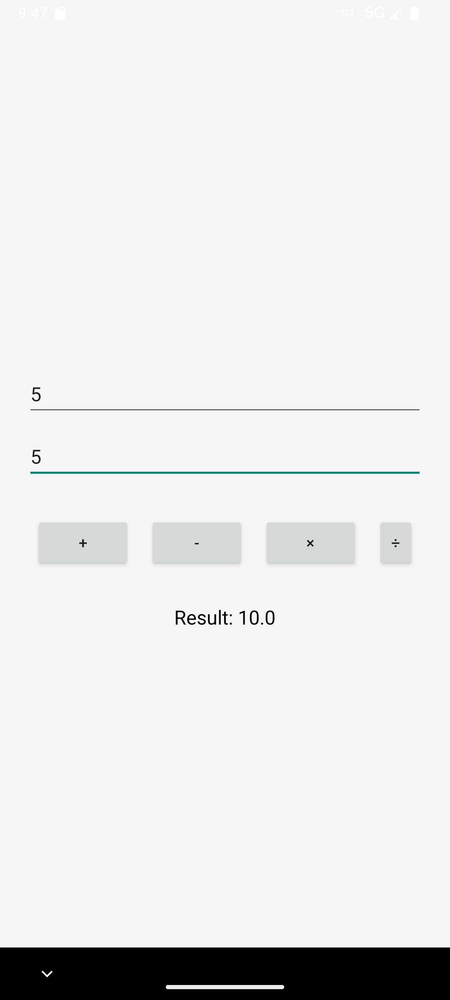

# 🔢 Simple Calculator App

A clean and functional Android Calculator built using **Java** and **Android Studio**. This app performs basic arithmetic operations like **Addition**, **Subtraction**, **Multiplication**, and **Division**.

---

## 📱 Features

- User-friendly number pad
- Supports basic operations:  
  ➕ Addition, ➖ Subtraction, ✖️ Multiplication, ➗ Division
- Instant clear/reset
- Clean and simple UI
- Built with Android SDK and Java

---

## 📁 Folder Structure

SimpleCalculator/ ├── app/ │ ├── src/ │ │ ├── main/ │ │ │ ├── java/com/example/simplecalculator/ │ │ │ │ └── MainActivity.java │ │ │ ├── res/ │ │ │ │ ├── layout/activity_main.xml │ │ │ │ ├── mipmap/ic_launcher.png │ │ │ │ └── values/strings.xml │ │ │ └── AndroidManifest.xml ├── screenshots/ │ ├── screenshot1.png │ ├── screenshot2.png │ └── screenshot3.png ├── build.gradle ├── README.md


---

## 🚀 Getting Started

To run this project locally:

1. Clone this repo:
   ```bash
   git clone https://github.com/your-username/SimpleCalculator.git
Open the project in Android Studio.

Build and run on an emulator or physical device.

📷 App Screenshots
Here are some previews of the Simple Calculator in action:

<div align="center">    </div>
📦 How to Build APK
In Android Studio, go to:

Build > Build Bundle(s) / APK(s) > Build APK(s)
Locate your APK at:


app/build/outputs/apk/debug/app-debug.apk
🛠 Tech Stack
Java

Android Studio

XML (UI Layout)

Git & GitHub

🧑‍💻 Author
Roni Seikh
🌐 GitHub: github.com/Roni-Seikh
🔗 LinkedIn: linkedin.com/in/roniseikh

📄 License
This project is licensed under the MIT License.


---


